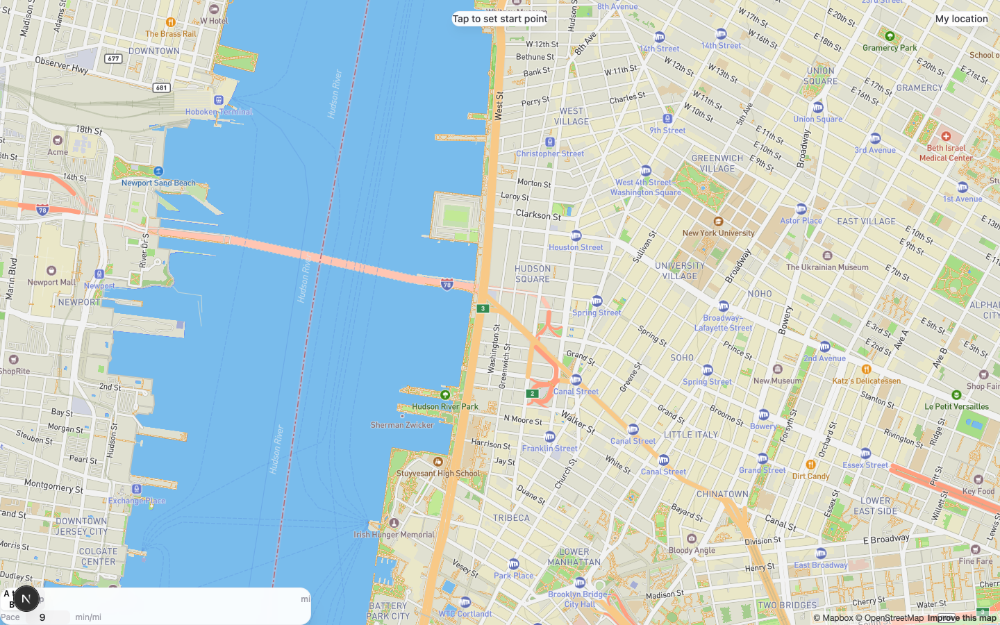
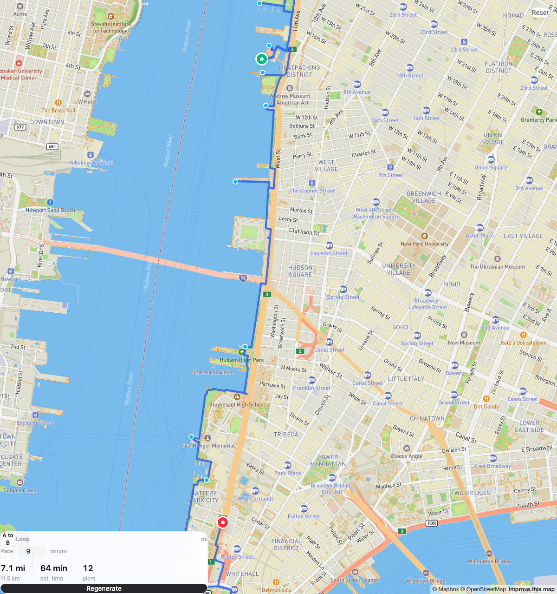
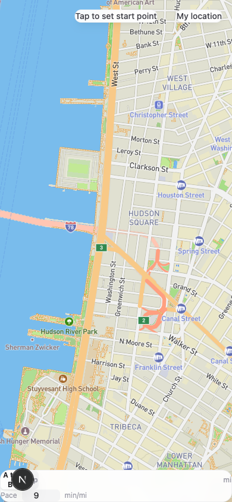
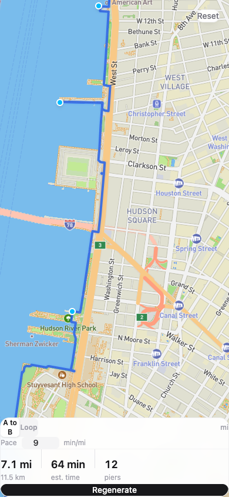

# Longest Path

A running route builder that generates the **longest logical path** between two points instead of the shortest one.

Strava's route builder optimizes for shortest path. That's not how runners think. When you're running along the waterfront, you *want* to go out on every pier. When you pass a park, you *want* to loop through it. This app builds routes the way a curious runner would — maximizing interesting exploration on dedicated running paths, while avoiding random zigzags through traffic.

## Screenshots

### Desktop

**Initial state** — full-screen Mapbox map (outdoors style), mode selector, pace input:



**Route generated** — 7.1 mile waterfront route hugging the Hudson River, going out on 12 piers:



### Mobile

| Initial state | Route with stats |
|---|---|
|  |  |

## How It Works

### The Algorithm: Path-Following, Not Point-Hopping

Traditional routing APIs find the shortest path. We do the opposite, but we don't just zigzag randomly to add distance. The algorithm works in five steps:

1. **Discover paths** — Queries [OpenStreetMap](https://www.openstreetmap.org/) via the Overpass API for all running infrastructure in the corridor between your start and end points: footways, cycleways, pedestrian paths, piers, parks, and waterfront features.

2. **Score paths** — Each path is scored based on:
   - **Water proximity** (+40) — paths within 300m of coastline, riverbanks, or waterfronts
   - **Named paths** (+35) — major running infrastructure like the Hudson River Greenway
   - **Path length** (+5/+10) — longer continuous paths are more likely to be real running routes
   - **Directional alignment** (-20 penalty) — inland paths perpendicular to your travel direction are penalized to prevent zigzagging
   - **Piers** (95 base) — always included as out-and-back detours

3. **Sample waypoints** — Instead of picking isolated points (which causes zigzagging), the algorithm samples waypoints every ~400m *along the actual path geometries*. This forces the route to follow continuous running infrastructure.

4. **Order and deduplicate** — Waypoints are projected onto the start-to-end travel axis and sorted. Duplicates within 150m are removed. Max 20 waypoints (Mapbox allows 25, minus start/end).

5. **Route through Mapbox** — The ordered waypoints are sent to the [Mapbox Directions API](https://docs.mapbox.com/api/navigation/directions/) with the `walking` profile and `walkway_bias=1`, which tells Mapbox to prefer dedicated walking/running paths over roads.

### Two Modes

- **A to B** — Pick a start and end point. The algorithm finds the longest interesting route between them, following waterfront paths and exploring piers along the way.
- **Loop** — Pick a start point and target distance. The algorithm divides the surrounding area into angular sectors, picks the best features in each sector, and creates a loop that attempts to match your target distance (within 15%).

## Tech Stack

| Layer | Technology |
|---|---|
| Framework | [Next.js](https://nextjs.org/) 16 (App Router) |
| Language | TypeScript |
| Map | [Mapbox GL JS](https://docs.mapbox.com/mapbox-gl-js/) via [react-map-gl](https://visgl.github.io/react-map-gl/) |
| Routing | [Mapbox Directions API](https://docs.mapbox.com/api/navigation/directions/) (walking profile) |
| Feature discovery | [Overpass API](https://overpass-api.de/) (OpenStreetMap) |
| State management | [Zustand](https://zustand-demo.pmnd.rs/) (3 slices: map, route, settings) |
| Styling | [Tailwind CSS](https://tailwindcss.com/) v4 |
| Unit tests | [Vitest](https://vitest.dev/) (58 tests) |
| E2E tests | [Playwright](https://playwright.dev/) (11 tests) |

## Project Structure

```
src/
├── app/
│   ├── page.tsx                    # Server component shell
│   ├── layout.tsx                  # Root layout + metadata
│   └── api/
│       ├── directions/route.ts     # Mapbox Directions proxy (hides token)
│       └── overpass/route.ts       # Overpass API proxy (CORS + 24h cache)
├── components/
│   ├── MapView.tsx                 # Top-level client component (dynamic import, ssr:false)
│   ├── MapContainer.tsx            # react-map-gl <Map> wrapper
│   ├── RouteLayer.tsx              # GeoJSON line rendering with glow effect
│   ├── WaypointMarkers.tsx         # Draggable start/end markers
│   ├── FeatureMarkers.tsx          # Pier markers on the route
│   ├── ModeSelector.tsx            # A-to-B / Loop toggle
│   ├── DistanceSlider.tsx          # Target distance for loop mode
│   ├── PaceInput.tsx               # Running pace (default 9 min/mi)
│   ├── RouteStats.tsx              # Distance, time, pier count
│   └── ProgressIndicator.tsx       # Step-by-step generation progress
├── hooks/
│   └── useGeolocation.ts           # Browser geolocation
├── lib/
│   ├── algorithm/
│   │   ├── route-pipeline.ts       # Top-level orchestrator
│   │   ├── path-sampler.ts         # Core: sample waypoints along path geometries
│   │   ├── overpass-query.ts       # Build Overpass QL + parse responses
│   │   ├── waypoint-ordering.ts    # Linear (A-to-B) and radial (loop) ordering
│   │   ├── loop-generator.ts       # Sector-based loop with distance iteration
│   │   ├── corridor.ts             # Expanded bounding box between two points
│   │   └── types.ts                # ScoredWaypoint, ProgressCallback, etc.
│   ├── api/
│   │   ├── mapbox-directions.ts    # Client for /api/directions
│   │   └── overpass.ts             # Client for /api/overpass
│   ├── geo/
│   │   ├── distance.ts             # Haversine, bearing, projection, movePoint
│   │   └── bbox.ts                 # Corridor and radius bounding boxes
│   └── constants.ts                # Scoring weights, API URLs, limits
├── store/
│   ├── index.ts                    # Combined Zustand store
│   ├── map-slice.ts                # Viewport, markers, interaction state
│   ├── route-slice.ts              # Route GeoJSON, stats, progress, generation
│   └── settings-slice.ts           # Mode, distance, units, pace
└── types/
    ├── geo.ts                      # LngLat, BBox, ViewState
    ├── overpass.ts                  # Overpass API response types
    └── route.ts                    # Route, RouteStats
```

## Getting Started

### Prerequisites

- Node.js 18+
- A [Mapbox](https://account.mapbox.com/auth/signup/) account (free tier is sufficient — 100k Directions API requests/month)

### Setup

```sh
git clone https://github.com/andreikorchagin/longest-path.git
cd longest-path
npm install
```

Create `.env.local` with your Mapbox token:

```
NEXT_PUBLIC_MAPBOX_TOKEN=pk.your_token_here
```

You can find your token at https://account.mapbox.com/ — copy the "Default public token".

### Run

```sh
npm run dev
```

Open http://localhost:3000. The map defaults to NYC's Lower Manhattan waterfront.

### Test

```sh
# Unit tests (Vitest)
npm test

# E2E tests (Playwright, headless)
npm run test:e2e:headless

# Type check
npm run typecheck
```

## How to Use

1. **Set your start point** — tap/click the map or use "My location"
2. **Set your end point** (A-to-B mode) — tap/click again
3. **Adjust your pace** — default is 9 min/mile
4. **Generate Route** — the app will:
   - Search for running paths in the area (~3-5 seconds)
   - Analyze the path network
   - Select the best waterfront and running path waypoints
   - Calculate the route through Mapbox
5. **View results** — distance, estimated time, and number of piers explored

In **Loop mode**, set a target distance with the slider instead of picking an end point.

## Key Design Decisions

**Why waypoint injection instead of a custom routing engine?**
Building a custom routing engine (like OSRM with custom Lua profiles) would give more control but requires running a server and pre-processing OSM data. Waypoint injection into Mapbox's Directions API works well enough: we control *where* the route goes by choosing waypoints, and Mapbox handles the actual turn-by-turn routing on valid paths. This keeps the app serverless and fast.

**Why server-side API proxies?**
The Mapbox token stays server-side (not in the client bundle). The Overpass proxy also solves CORS issues and adds a 24-hour in-memory cache — OSM data doesn't change often enough to re-query every time.

**Why "path-following" instead of "point-hopping"?**
The first version of the algorithm picked isolated feature centroids (park center, path midpoint) as waypoints. Mapbox connected them via shortest paths through random streets, creating chaotic zigzag routes. The fix: sample waypoints *along actual path geometries* at regular intervals. This forces Mapbox to route along the running path instead of cutting through streets.

**Why pace-based duration instead of Mapbox's walking time?**
Mapbox's walking profile assumes ~3 mph walking speed. Runners go 5-8 mph. Duration is now calculated as `distance * pace`, with the default at 9 min/mile. Users can adjust this in the UI.

## Future Improvements

- Preference toggles (waterfront, parks, avoid traffic)
- Elevation profile display
- Share route via URL (encode start/end/mode in query params)
- Save favorite routes (localStorage)
- Strava/Garmin export (GPX)
- Pre-indexed popular running paths for faster queries in major cities
